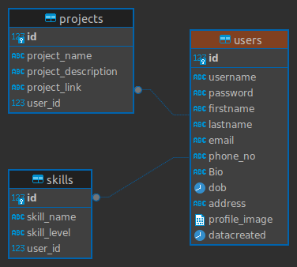

# PersonalSkill Portal

PersonalSkill Portal is a full-stack web application built with Flask and React for managing user registrations, logins, and profiles with secure access token authentication. Upon successful login, users are directed to a personalized dashboard displaying their personal information, skills, and project details.

## Features

- **User Authentication:** Secure user registration and login using access tokens.
- **Personalized Dashboard:** Display of personal information, skills, and project details.
- **Technology Stack:** Flask, React, SQLAlchemy, and more (add specific technologies as applicable).
- **Deployment:** Deployment on platforms like Render or your preferred hosting service.

# Technologies Used

### Frontend

- **React**

React is used as the frontend JavaScript library for building user interfaces.

### Backend

- **Flask**
- **SQLAlchemy**

Flask is a lightweight Python web framework used for building backend APIs and serving web pages. SQLAlchemy is used as the ORM (Object-Relational Mapping) tool for database interactions.

### Database

- **SQL Server** 

SQL Server for the relational database management system used with SQLAlchemy in the Flask backend.


### DataBase Schema



This is the DataBase Schema for my project

---

## Installation

1. **Clone the Repository:**
   ```bash
   git clone https://github.com/mittamahesh/PersonaSkill-Portal.git
   cd repo
